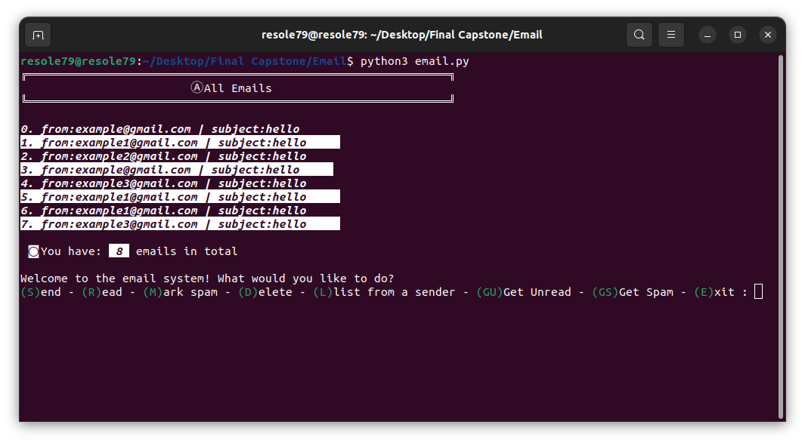
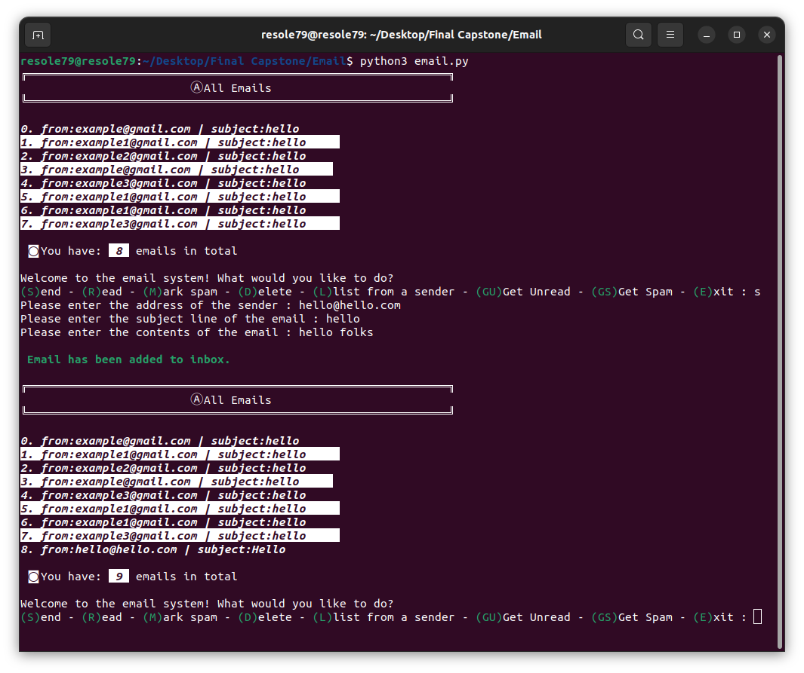
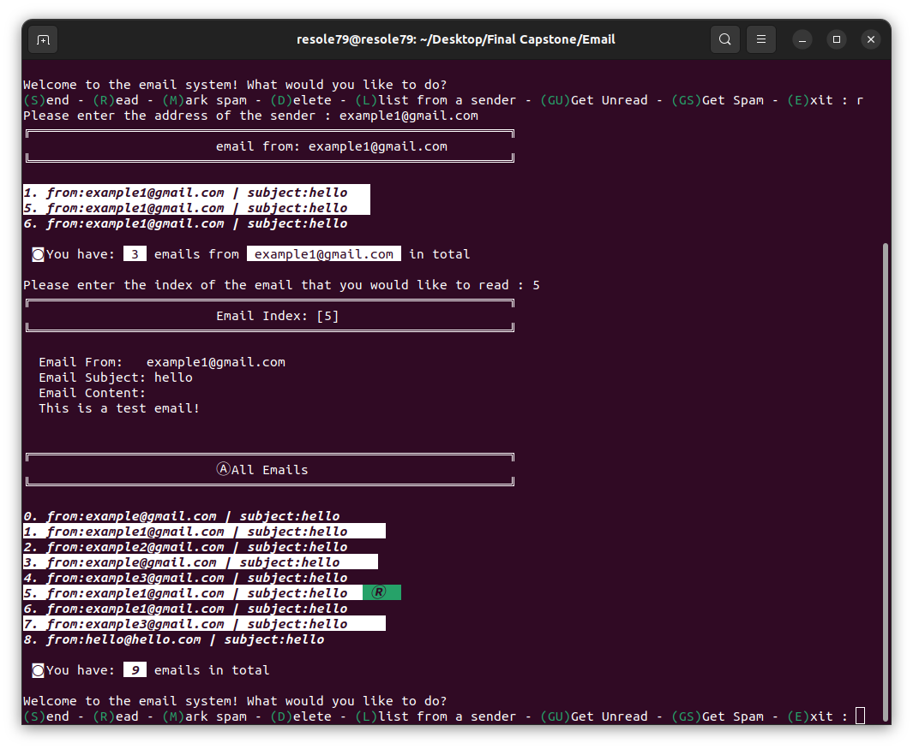
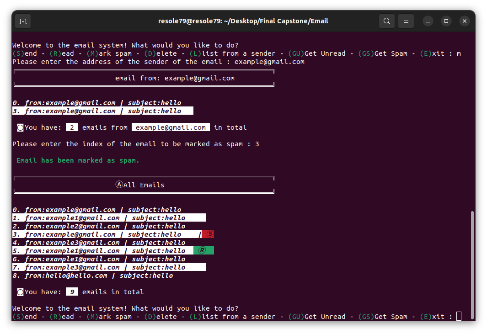
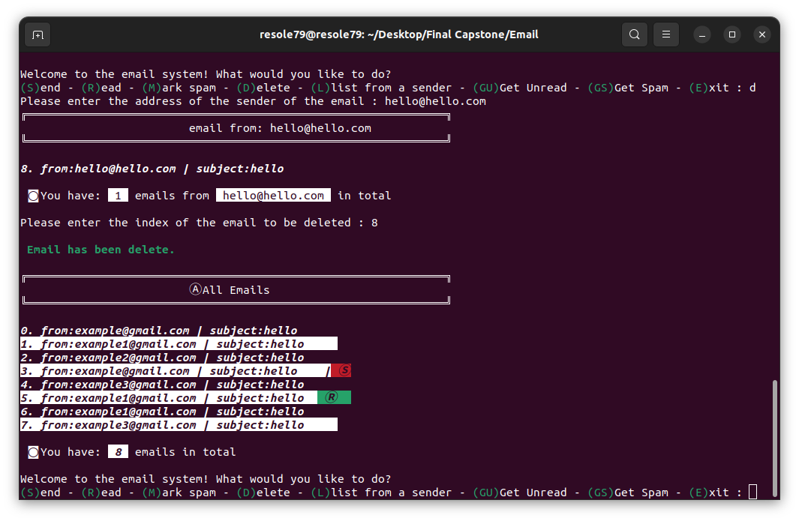
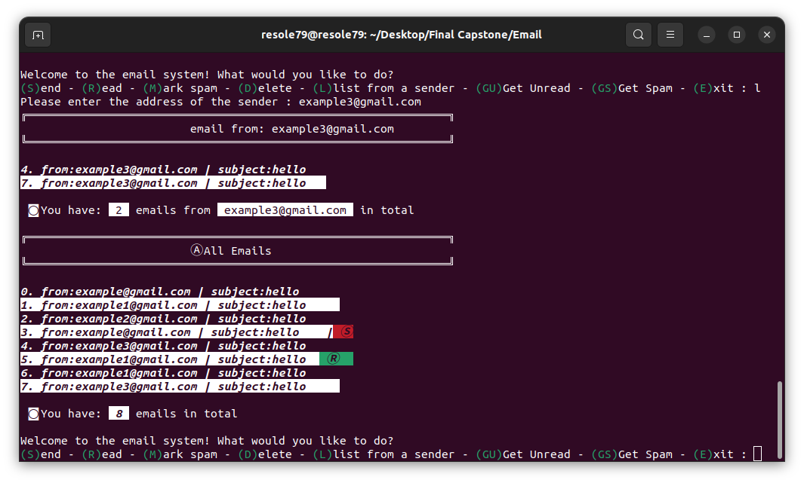
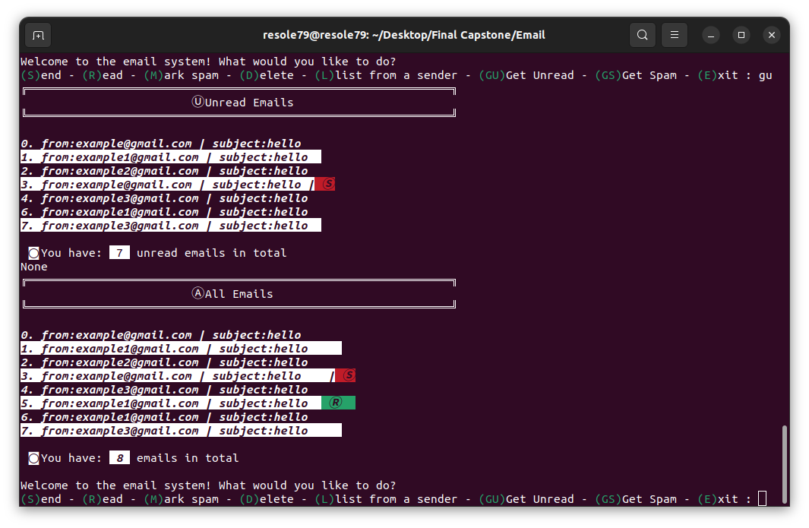
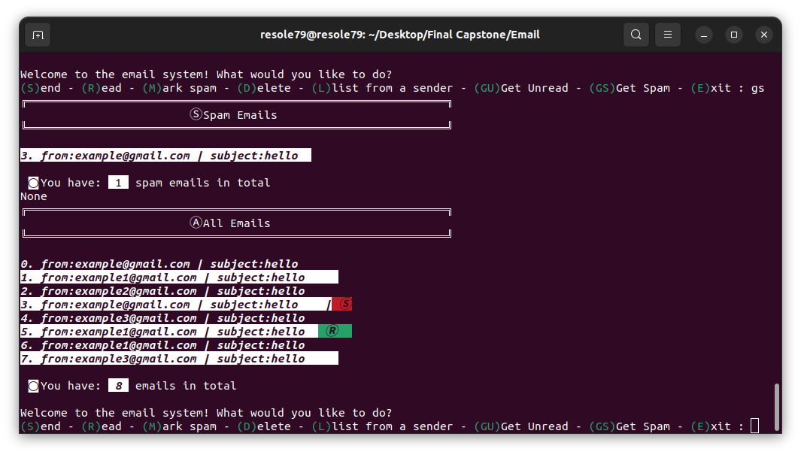

## Email Simulator 

Program that going to be simulating an email message, allows users to send, receive, read, mark as spam, and delete emails.

#### Prerequisites
You will need the following software to run the Email Simulator  :
 - [Python 3](https://www.python.org/downloads/)

#### Installation
To get started with the Email Simulator , follow these steps:


1. **Clone** the repository:

```sh
git clone https://github.com/resole79/email_simulator.git
```

3. **Run** the **email.py** file:

```sh
python3 email.py
```


#### File Structure   
 - **email.py**: Main program.


#### **Usage**

**How program present**

<p align="center"><br><i>menu</i></p>

**User selects *‘s’* to send an email**

Ask the user to input:
 - address of the sender
 - Subject line of the email
 - Contents of the email

<p align="center"><br><i>user selects “s”</i></p>


**User selects *‘r’* to read an email**

Ask the user to input:
 - Address of the sender of the email
 - Index of the email that you would like to read

<p align="center"><br><i> user selects “r” <br> email marked as "read" </i></p>


**User selects *‘m’* to mark as spam**

Ask the user to input:
 - Address of the sender of the email
 - Index of the email that you would like to mark us spam

<p align="center"><br><i> user selects “m” <br> email marked as "spam" </i></p>


**User selects *‘d’* to delete an email**

Ask the user to input:
 - Address of the sender of the email
 - Index of the email that you would like to delete

<p align="center"><br><i> user selects “d”</i></p>


**User selects *‘l’* to list email from sender**

Ask the user to input:
 - Address of the sender of the email

<p align="center"><br><i> user selects “l”</i></p>


**User selects *‘gu’* to list unread email**

<p align="center"><br><i> user selects “gu”</i></p>


**User selects *‘gs’* to list spam email**

<p align="center"><br><i> user selects “gs”</i></p>


## **Credit**

Author : Emilio Reforgiato (resole79)

##
<p align="right"><a href="https://www.linkedin.com/in/emilio-reforgiato/" target=”_blank” ></a></p>

